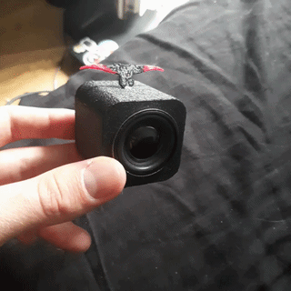
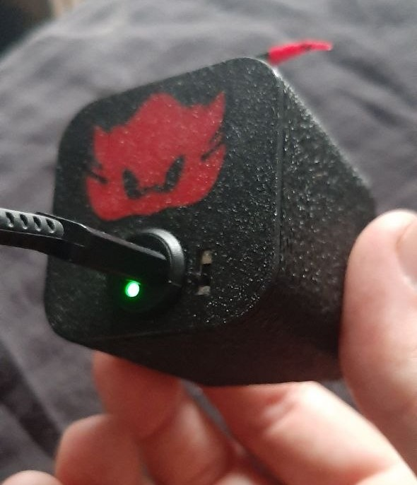
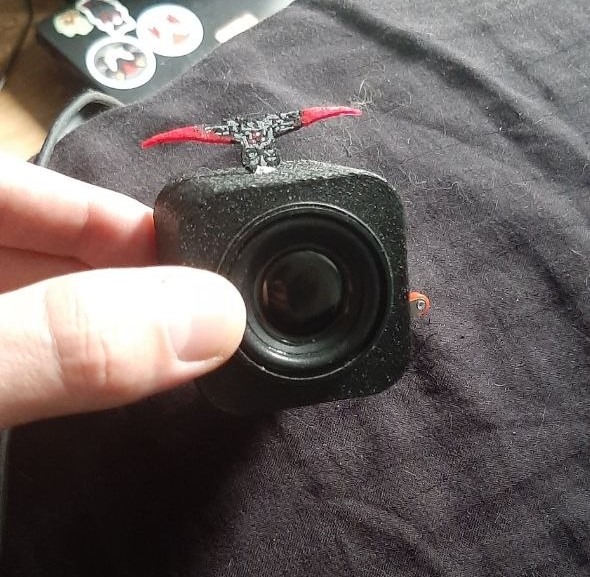
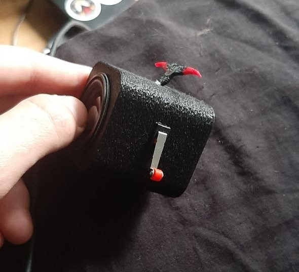
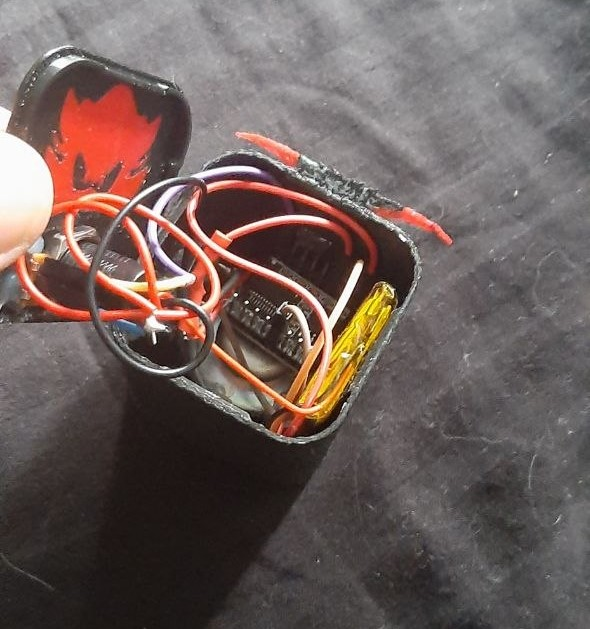
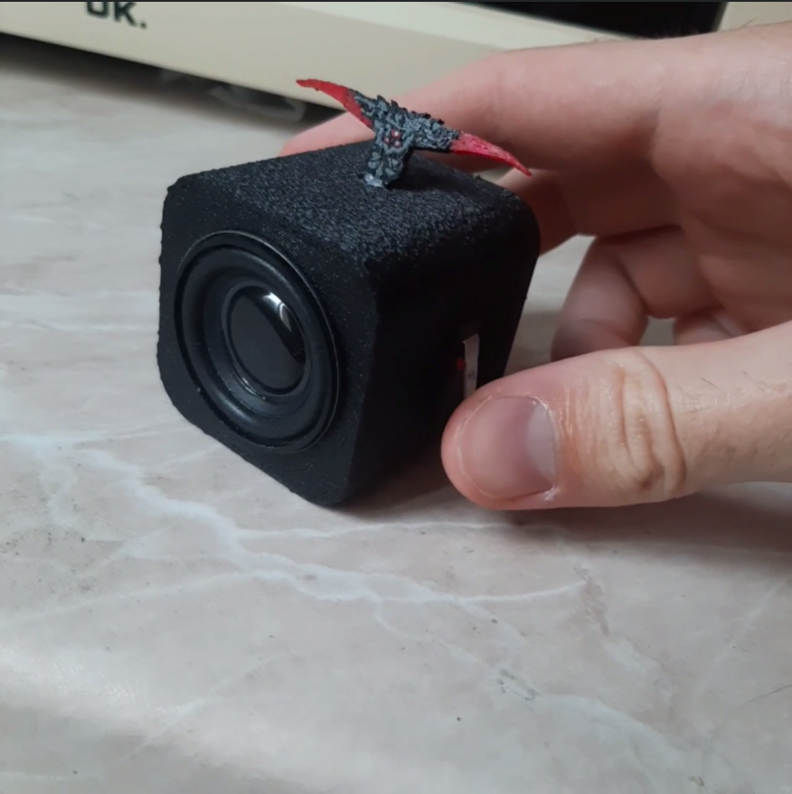

# Audio Gift Cube

A small DIY audio gift box that plays one short audio message when the button is pressed.

The project was made as a simple personal gift: the user turns the cube on, presses the top button once, and the stored audio clip plays from the DFPlayer Mini through a small speaker.

The enclosure is 3D printed and glued together. The build is functional, but not very clean mechanically. Some parts are fixed with glue, so the internal assembly is not ideal and repairability is limited.

## Features

- Plays one audio file from a microSD card
- One-button audio trigger
- 3.7V LiPo battery powered
- USB-C charging through a TP4056 charger module
- Physical ON/OFF power switch
- 3D printed enclosure
- Simple circuit without MCU / ESP32

## Hardware

| Component | Purpose |
|---|---|
| DFPlayer Mini | MP3 playback from microSD |
| microSD card | Stores the audio file |
| LiPo 3.7V battery | Main power source |
| USB-C TP4056 module | Battery charging |
| 1P2T switch | Power ON/OFF |
| KW11-3Z microswitch | Play button trigger |
| Speaker | Audio output |

## Pinout

| Connection | From | To |
|---|---|---|
| Battery + | LiPo + | BAT+ |
| Battery - | LiPo - | GND |
| Charger + | USB-C TP4056 red / + | BAT+ |
| Charger - | USB-C TP4056 black / - | GND |
| Power switch input | BAT+ | SW1 COM |
| Power switch output | SW1 output | DFPlayer VCC |
| DFPlayer ground | DFPlayer GND | GND |
| Speaker | DFPlayer SPK1 | Speaker pin 1 |
| Speaker | DFPlayer SPK2 | Speaker pin 2 |
| Play trigger | DFPlayer IO2 / ADKEY1 | KW11-3Z NO |
| Button ground | KW11-3Z COM | GND |

> The speaker is connected only between `SPK1` and `SPK2`. It is not connected to GND.

## Usage

1. Format the microSD card as FAT32.
2. Copy one audio file to the card.
3. Name it `0001.mp3`.
4. Insert the card into the DFPlayer Mini.
5. Turn the cube on using the power switch.
6. Press the top button once.
7. The audio plays until the end.

## Video

### Demo

| Front | Inside |
|---|---|
|  |  |
|  |  |

Alternative video link:

## Known Limitations

- The enclosure is glued together poorly.
- The 3D printed box has visible imperfections.
- Internal wiring is not very serviceable.
- The battery level is not displayed.
- There is no volume control on the outside.
- The device has no MCU, so playback behavior depends on the DFPlayer Mini.
- The USB-C charger is panel-mounted, but the whole cube is not waterproof.
- The build works, but it is more of a prototype than a polished product.

## Future Improvements

- Redesign the enclosure with screws instead of glue.
- Add proper internal mounting posts for the PCB, battery, and speaker.
- Add a cleaner top button mechanism.
- Add a capacitor for better power stability.
- Add battery level indication.
- Add volume buttons or fixed volume tuning.
- Use an MCU to control playback more reliably.
- Improve the speaker grille and acoustic cavity.
- Make the device easier to open and repair.
